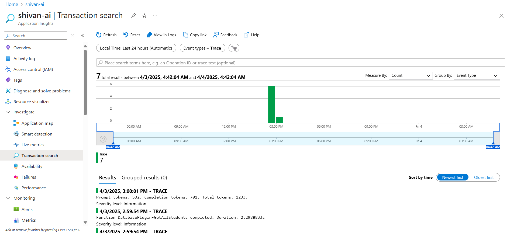

# Instructions for LAB

## Prerquisites

- An Azure OpenAI Instance with gpt-4o model deployed
- Provide yourself following RBAC Roles on your Azure OpenAI instance
    - Cognitive Services OpenAI USer
    - Cognitive Services User
- An Application Insights Instance
    - Take a note of the Connection String

## Steps

- Clone this repo
    ```
    git clone https://github.com/Shivanjali-12/Semantic-Kernel-Workshop
    ```

- Ensure that all the dependencies are installed
- Navigate to Program.cs file
    - Add you OpenAI instance Endpoint
        ```
        // Populate values from your OpenAI deployment
        var ModelId = "gpt-4o";
        var endpoint = "https://learn-o-tron.openai.azure.com/"; //Replace with Endpoint of your OpenAI instance
        ```

    - Correct the path of students.json file
        ```
        //Adding Database Plugin
        var databasePlugin = new DatabasePlugin("C:\\learn-o-tron\\Semantic-Kernel-Workshop\\students.json"); //Replace with correct path
        kernel.Plugins.AddFromObject(databasePlugin);
        ```

- Run the program. You should be able to see the logs in console.

- Navigate back to Program.cs file

    - Add OpenTelemetry Exporter for Application Insights
        ```
        //Adding Application Insights Exporter
        options.AddAzureMonitorLogExporter(options => options.ConnectionString = "<APP-INSIGHTS CONNECTION STRING>");
        ```

- Running the program now should send logs to your application insights instance as well. You can see those by navigating to "Transaction Search" section in the left panel and selecting Event Types as "Trace"

    

- Add FilePlugin and DateTimePlugin to the Kernel now.

    ```
    //Adding File Plugin
    var filePlugin = new FilePlugin("<PATH_TO_RECOMMENDATIONS.TXT_FILE>");
    kernel.Plugins.AddFromObject(filePlugin);

    //Adding DateTime Plugin
    var dateTimePlugin = new DateTimePlugin();
    kernel.Plugins.AddFromObject(dateTimePlugin);
    ```

- Modify the system prompt according to following use case:
    - A Classroom assistant that provides book recommendations for students based on their age and interests.
    - Appends the Recommendations and time of recommendations to a text file.

    Tip: Age should be calculated by using Student's DOB and Current Date.